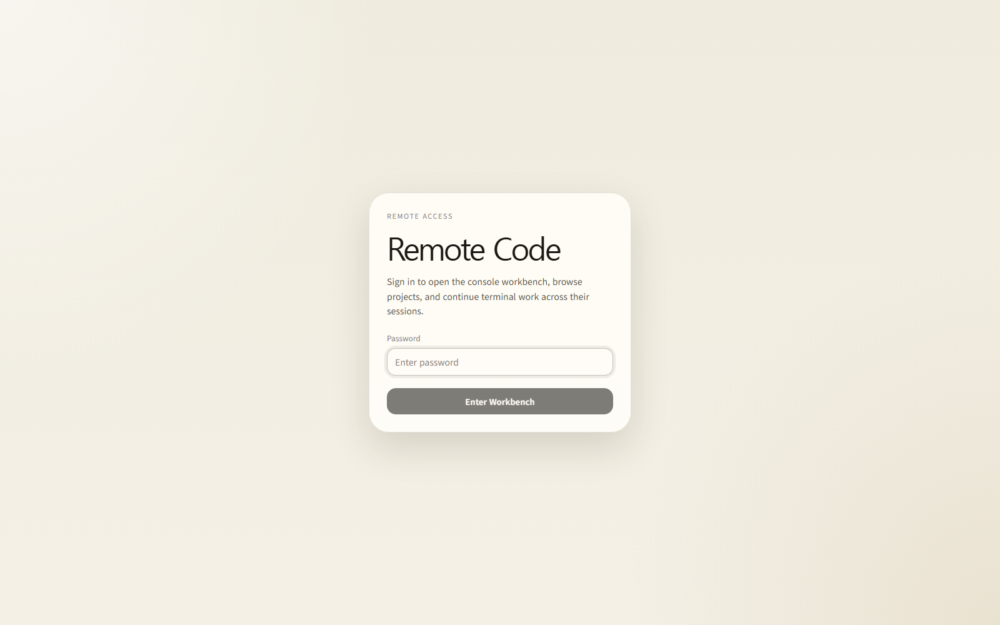
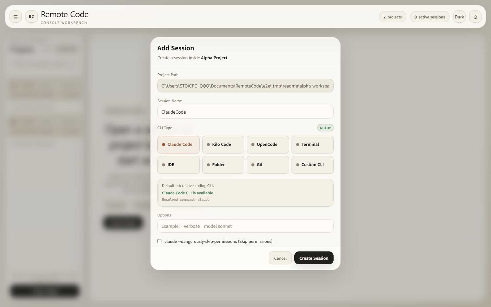
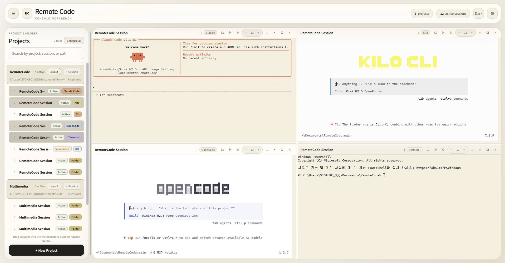
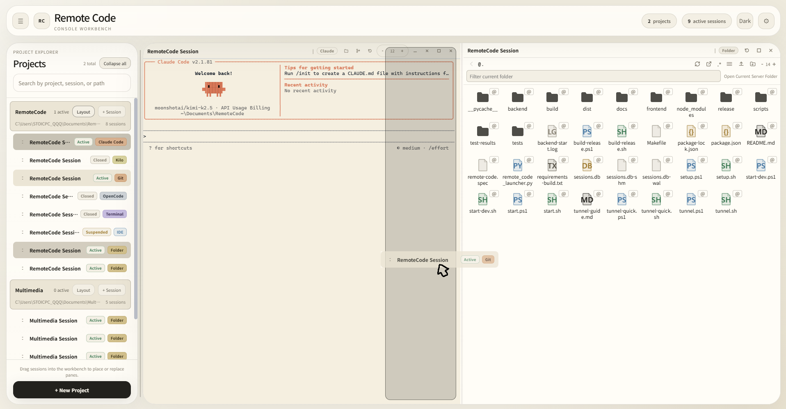
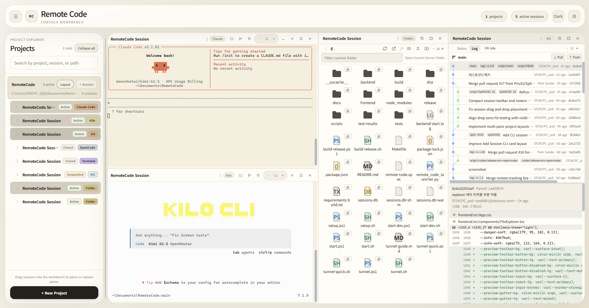
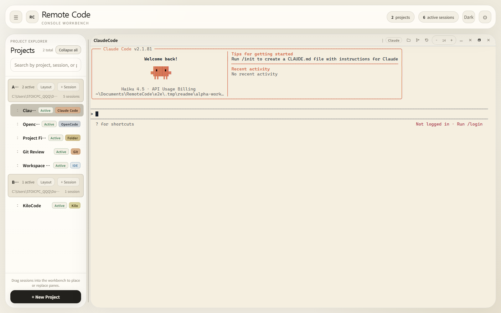
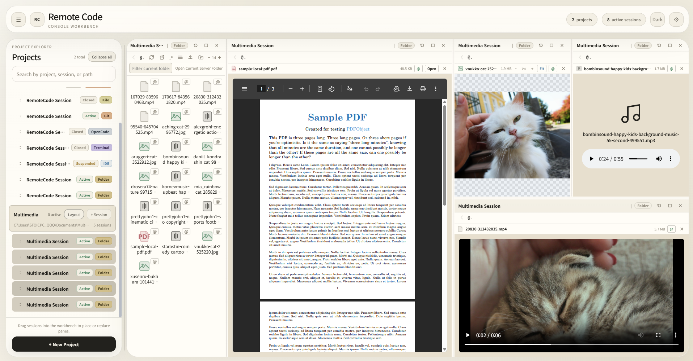
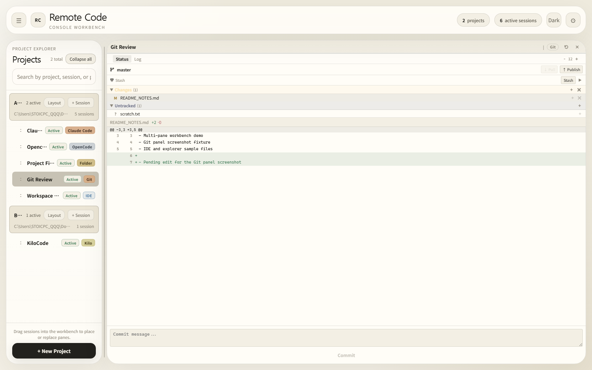
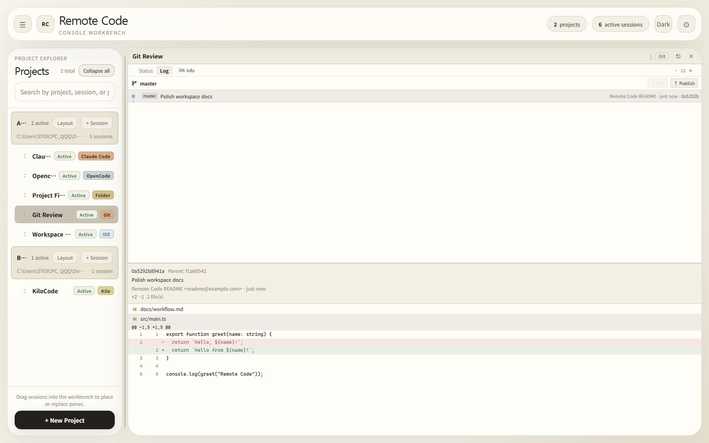
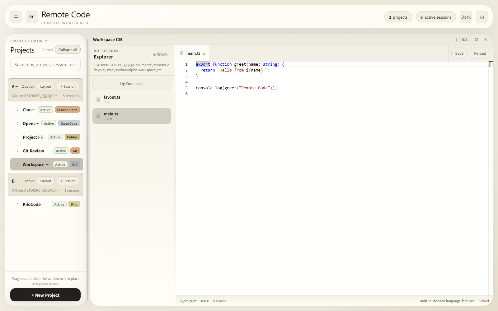

# Remote Code


[](https://www.python.org/)
[](https://nodejs.org/)

Remote Code is a self-hosted browser workbench for terminal-first coding workflows.
It keeps your terminals, File Explorer, Git tools, and Monaco-based editor attached to local projects while letting you arrange them as reusable multi-pane layouts in the browser.

## Why Remote Code

- Run coding sessions in the browser while files, Git state, and CLI tools stay on your own host.
- Keep multiple working contexts open at once with drag-and-drop pane layouts.
- Save and reopen project layouts instead of rebuilding your workspace every time.
- Mix terminal, File Explorer, Git, and IDE panels in one workbench.
- Preserve long-running terminal sessions in the same tab while you resize panes or switch views.

## Key Capabilities

| Capability | What it does |
| --- | --- |
| Terminal-Backed Sessions | Start `ClaudeCode`, `Opencode`, `KiloCode`, plain terminal, or custom CLI sessions in the browser while the real process runs locally. |
| Multi-Pane Workbench | Drag any session into the left, right, top, bottom, or center of a pane to split, replace, and rearrange your layout. |
| Saved Project Layouts | Store one layout per project and reopen it from the project rail with the `Layout` button. |
| Mixed Session Layouts | Build a saved layout from sessions in the current project and from other projects in the same workspace. |
| Keep-Alive Terminals | Keep xterm instances, scrollback, and terminal state alive in the same browser tab while switching views and resizing panes. |
| File Explorer | Browse folders, preview files, upload, download, rename, delete, and create folders from the UI. |
| Git Panel | Inspect status, diffs, history, branches, stash, pull, push, and commit actions without leaving the browser. |
| IDE Workspace | Open a Monaco-based editor session with file editing and language-aware tooling. |
| Open Alone and Restore | Focus on one pane temporarily, then jump back to the previous multi-pane layout with one click. |
| Flexible Session Types | Use `claude`, `kilo`, `opencode`, `terminal`, `custom`, `folder`, `git`, and `ide` sessions from the same app. |

## Feature Tour

### Login



*Password-protected entry keeps the browser client simple while the backend owns the authenticated session cookie.*

*Initial password: `changeme`*

### Create a Project and Session



*Create terminal, File Explorer, Git, IDE, or custom CLI sessions inside a project workspace.*

### Terminal Session



*Run `ClaudeCode`, `Opencode`, or `KiloCode` in the browser while the real process stays on your host. Same-tab keep-alive helps preserve terminal state and scrollback while you move around the workbench.*

### Drag-and-Drop Layout Editing



*Drag sessions into any edge or center region to split panes, replace panes, and build larger multi-pane layouts.*

### Saved Project Layout



*Project layouts reopen from the `Layout` button and can include mixed session types, including sessions from other projects.*

### Open Alone and Restore Layout



*Focus on a single pane with `Open Alone`, then jump back to the previous layout with `Restore Layout`.*

### File Explorer



*Browse the workspace, inspect files, and manage folders without dropping back to the system file manager.*

### Git Panel

<table>
  <tr>
    <td width="50%">
      
    </td>
    <td width="50%">
      
    </td>
  </tr>
  <tr>
    <td><em>Status view with a changed file selected and its diff preview open.</em></td>
    <td><em>Log view with a commit selected, changed files listed, and a file diff visible.</em></td>
  </tr>
</table>

*Review working tree changes and commit history from the same Git session without leaving the browser.*

### IDE Workspace



*Open a Monaco-based editor workspace beside your terminal workflows when you need structured file editing.*

## Requirements

- Python 3.10+
- Node.js 18+ for source builds
- At least one CLI available in `PATH`
  - `claude` for Claude Code sessions
  - `kilo` for Kilo Code sessions
  - `opencode` for OpenCode and OpenCode Web sessions

Remote Code does not bundle those CLIs for you. The packaged app and the source install both expect the selected CLI to already exist on the host.

## Getting Started

### Option A: Download and Run from Releases

1. Open the GitHub Releases page and download the archive for your platform.
2. Extract the archive.
3. Choose the packaged runtime you want:
   - `web`: starts the bundled backend and opens your default browser
   - `chromium`: launches the bundled Remote Code Desktop shell directly
4. Launch the packaged app.
   - Windows `web`: run `Remote Code/Remote Code.exe`
   - Windows `chromium`: run `Remote Code Desktop/Remote Code Desktop.exe`
   - macOS `web`: open `Remote Code.app`
   - macOS `chromium`: open `Remote Code Desktop.app`
5. Sign in with the password stored in the runtime `.env` file and change it before exposing the app outside your machine.

Runtime data is stored outside the repository:

- Windows: `%APPDATA%\Remote Code`
- macOS: `~/Library/Application Support/Remote Code`

The packaged launcher stores its runtime `.env` and `sessions.db` there. It also generates a secure JWT secret automatically when needed.
That runtime `.env` can contain both `CCR_*` app settings and Claude Code provider variables such as `CLAUDE_CODE_USE_BEDROCK`, `AWS_*`, `ANTHROPIC_*`, and `OPENROUTER_*`. Remote Code only parses `CCR_*`; the provider variables are passed through to Claude Code sessions.

### Option B: Run from Source

1. Clone the repository.

```bash
git clone https://github.com/PriuS2/RemoteCode.git
cd RemoteCode
```

2. Install dependencies.

```bash
# Windows
.\setup.ps1

# Linux / macOS
chmod +x *.sh
./setup.sh

# Optional
make setup
```

3. Review `.env`.

```env
CCR_HOST=0.0.0.0
CCR_PORT=8080
CCR_CLAUDE_COMMAND=claude
CCR_KILO_COMMAND=kilo
CCR_OPENCODE_COMMAND=opencode
CCR_PASSWORD=changeme
CCR_JWT_SECRET=change-this-secret-key
CCR_JWT_EXPIRE_HOURS=72
CCR_DB_PATH=sessions.db
```

Minimum changes before real use:

- Set `CCR_PASSWORD` to a real password.
- Set `CCR_JWT_SECRET` to a secure random string.
- Set `CCR_ALLOWED_ORIGINS` in production if you expose the app behind a domain.

You can also keep Claude Code provider variables in the same `.env`. Remote Code ignores them for its own config and passes them to the Claude CLI process.

4. Start the app.

```bash
# Production mode (web runtime)
# Windows
.\start.ps1 -Runtime web

# Linux / macOS
./start.sh --runtime web

# Chromium desktop runtime
# Windows
.\start.ps1 -Runtime chromium

# Linux / macOS
./start.sh --runtime chromium

# Optional
make start
```

5. Open `http://localhost:8080` and sign in with `CCR_PASSWORD`.

#### Development Mode

Use development mode when you want the Vite frontend and the reloading backend:

```bash
# Windows
.\start-dev.ps1 -Runtime web

# Linux / macOS
./start-dev.sh --runtime web

# Chromium desktop runtime
# Windows
.\start-dev.ps1 -Runtime chromium

# Linux / macOS
./start-dev.sh --runtime chromium

# Optional
make dev
```

Development mode serves the frontend at `http://localhost:5173` and proxies API and WebSocket traffic to the backend.

#### Optional Desktop Launcher in Source Mode

You can also launch the local packaged-style web runner directly from source:

```bash
python remote_code_launcher.py
```

The Chromium desktop runtime adds a few desktop-only behaviors on top of the same backend:

- browser-default shortcut blocking for Claude Code and OpenCode terminal flows
- window size and position restore
- single-instance behavior
- native folder picker for project creation
- desktop notifications and external-link handoff to the system browser
- tray/background keep-alive with `Hide to Tray` as the default close behavior
- dedicated project windows and dedicated single-session windows
- recent-project integration for tray, macOS dock menu, and Windows jump list/tasks
- launch-at-login preference and desktop-only version/update-manifest visibility in Settings

## Basic Usage

1. Sign in with the configured password.
2. Create a project and point it at a workspace folder.
3. Add a terminal-backed session such as `ClaudeCode`, `Opencode`, `KiloCode`, `Terminal`, or `Custom`.
4. Add `Folder`, `Git`, or `IDE` sessions when you want dedicated project panels alongside terminals.
5. Single-click a session in the sidebar to open a temporary one-pane workspace.
6. Drag sessions into any pane edge or center to split, replace, and rearrange the layout.
7. Use the project `Layout` button to reopen the saved project layout at any time.
8. Use `Open Alone` when you want to focus on one pane, then `Restore Layout` to return.
9. Suspend, resume, rename, reorder, or delete sessions from the project rail.

## Configuration

Most users only need a few settings:

| Variable | Purpose |
| --- | --- |
| `CCR_PORT` | Backend port for the app |
| `CCR_PASSWORD` | Password used by the login screen |
| `CCR_JWT_SECRET` | Secret used to sign auth tokens |
| `CCR_CLAUDE_COMMAND` | Command used for Claude Code sessions |
| `CCR_KILO_COMMAND` | Command used for Kilo sessions |
| `CCR_OPENCODE_COMMAND` | Command used for OpenCode sessions |
| `CCR_DB_PATH` | SQLite database path |
| `CCR_ALLOWED_ORIGINS` | Allowed browser origins for production deployments |

For the full list, see [docs/configuration.md](docs/configuration.md).

## Session Types

`folder`, `git`, and `ide` sessions are saved panel sessions. The others are terminal-backed sessions that attach to a running local process.

| Session Type | Description |
| --- | --- |
| `claude` | Claude Code CLI session |
| `kilo` | Kilo Code CLI session |
| `opencode` | OpenCode terminal session |
| `terminal` | Plain shell session |
| `custom` | User-provided command with optional custom exit command |
| `folder` | Saved File Explorer panel session |
| `git` | Saved Git panel session |
| `ide` | Monaco-based editor workspace session |

## Build a Release

If you want to produce distributable archives yourself:

```bash
# Windows
.\build-release.ps1 -Target all

# macOS
chmod +x build-release.sh
./build-release.sh --target all

# Build only one runtime
.\build-release.ps1 -Target web
.\build-release.ps1 -Target chromium

# Optional
make build-release
```

The packaged output is written to `release/` and now includes separate `web` and `chromium` archives.
Chromium builds also emit a platform-specific `update-manifest-*.json` file for future in-app update checks.

## Deployment and Advanced Topics

- [docs/README.md](docs/README.md): documentation index
- [docs/configuration.md](docs/configuration.md): runtime settings and environment variables
- [docs/deployment.md](docs/deployment.md): deployment and tunnel guidance
- [docs/backend-api.md](docs/backend-api.md): REST and WebSocket reference
- [docs/architecture.md](docs/architecture.md): backend and frontend architecture
- [docs/websocket-protocol.md](docs/websocket-protocol.md): terminal WebSocket behavior
- [docs/verification-checklist.md](docs/verification-checklist.md): smoke-test checklist after changes

## Security Notes

- Change `CCR_PASSWORD` before using the app beyond local testing.
- Never leave `CCR_JWT_SECRET` at the insecure default.
- Prefer HTTPS or a trusted tunnel when exposing the app externally.
- Restrict `CCR_ALLOWED_ORIGINS` for production deployments.

## License

MIT
